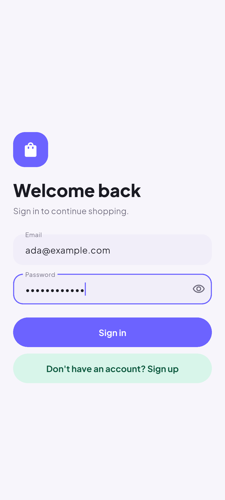
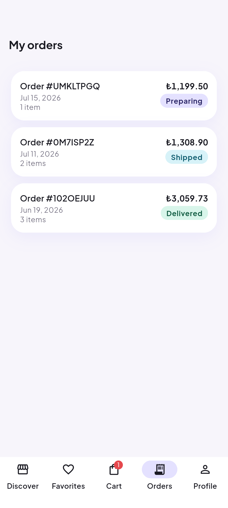
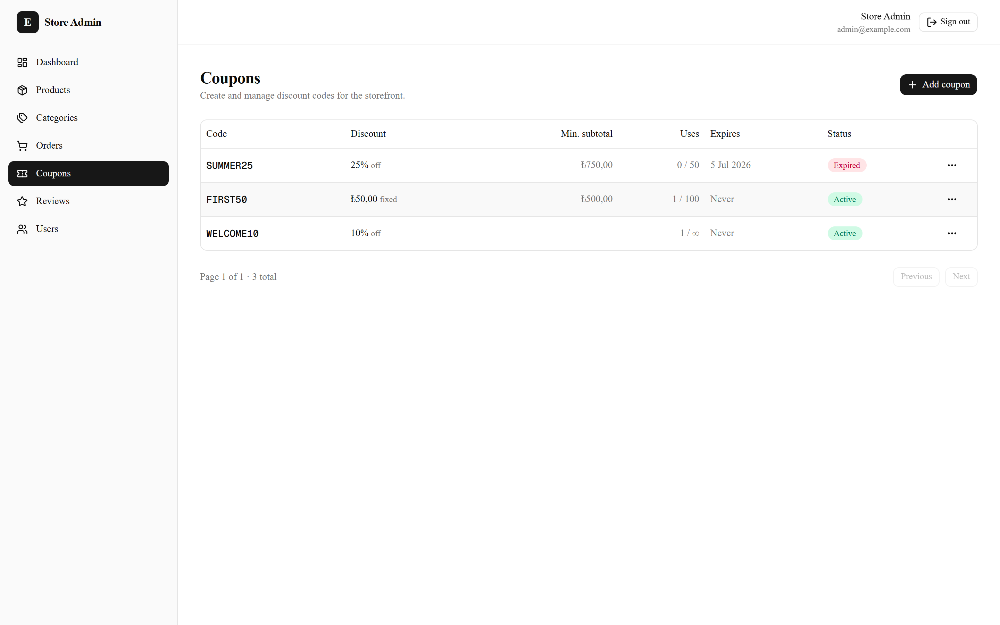
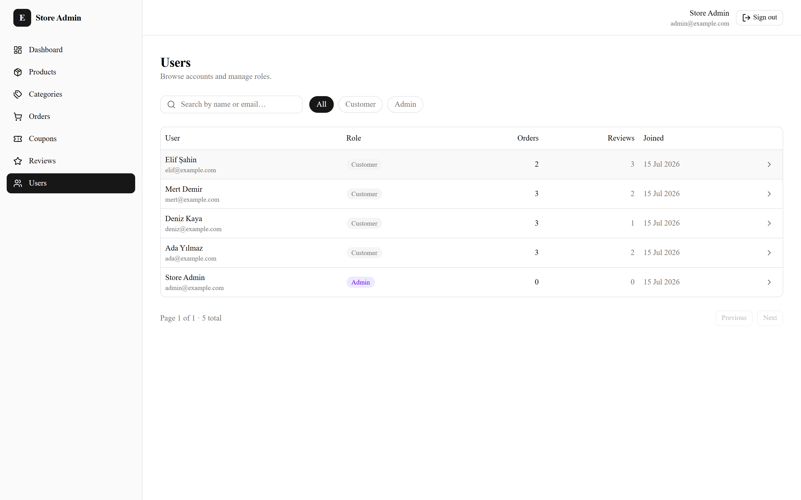

# 🛒 E-Commerce Platform

[](https://github.com/gorkdev/ecommerce-app/actions/workflows/api.yml)
[](https://github.com/gorkdev/ecommerce-app/actions/workflows/admin.yml)
[](https://github.com/gorkdev/ecommerce-app/actions/workflows/mobile.yml)

A full-stack, production-style e-commerce platform built as a portfolio project.
It pairs a **Flutter** mobile storefront with a **NestJS** API, a **Next.js** admin
dashboard, **PostgreSQL** + **MinIO** for data and media, and **Stripe** for payments —
all orchestrated with **Docker Compose**.

> **Status:** ✅ Feature-complete — built milestone by milestone.

## Screenshots

### Mobile app (Flutter)

<p>
  
  
  
  
  
</p>
<p>
  
  
</p>

The mobile screenshots are generated by an on-device integration test that
walks the real app against the seeded API
(`mobile/integration_test/screenshots_test.dart`).

### Admin panel (Next.js)

<p>
  
  
</p>
<p>
  
  
</p>
<p>
  
  
</p>

## Architecture

```
        ┌──────────────┐          ┌──────────────┐
        │  Flutter app │          │   Next.js    │
        │  (customer)  │          │  admin panel │
        └──────┬───────┘          └──────┬───────┘
               │      REST / JWT         │
               └────────────┬────────────┘
                            ▼
                   ┌──────────────────┐
                   │    NestJS API    │
                   │  (REST · JWT)    │
                   └───┬──────────┬───┘
                       │          │
              ┌────────▼───┐  ┌───▼──────────┐
              │ PostgreSQL │  │    MinIO     │
              │  (Prisma)  │  │ (S3 images)  │
              └────────────┘  └──────────────┘
                       │
                ┌──────▼──────┐
                │   Stripe    │  (test mode · webhooks)
                └─────────────┘
```

## Tech Stack

| Layer | Technology | Version |
|-------|-----------|---------|
| Mobile (customer) | Flutter · Riverpod · Dio · go_router | Flutter 3.41+ · Riverpod 3 |
| Backend API | NestJS · Prisma | NestJS 11 · Prisma 7 |
| Database | PostgreSQL | 18 |
| Object storage | MinIO (S3-compatible) | latest |
| Admin panel | Next.js · React · TanStack Query · Tailwind | Next 16 · React 19 |
| Payments | Stripe (test mode) | stripe-node 22 · flutter_stripe 13 |
| Runtime | Node.js | 24 LTS |
| Orchestration | Docker Compose | — |

> Version choices are deliberately the **latest *stable*** of each tool (no betas/RCs).

## Repository Structure

```
ecommerce-app/
├── api/                # NestJS + Prisma REST API
├── admin/              # Next.js admin dashboard
├── mobile/             # Flutter customer app
├── docker-compose.yml  # postgres + minio (infra)
└── .env.example        # configuration template
```

## Getting Started

```bash
# 1. Copy environment template
cp .env.example .env

# 2. Bring up the infrastructure (PostgreSQL + MinIO)
docker compose up -d

#    MinIO console:  http://localhost:9001  (minioadmin / minioadmin)
#    PostgreSQL:     localhost:5432

# 3. Set up the API, then load the demo store (optional but recommended)
cd api && npm install && npx prisma migrate dev
npm run prisma:seed
```

The seed fills the store with categories, products (placeholder images
included), coupons, orders and reviews, and prints the demo sign-in
credentials for the admin panel and the mobile app.

Per-service setup (api / admin / mobile) is documented in each subfolder's README
as those milestones land.

## Roadmap

- [x] **M0** — Repo, docs, infra skeleton (Postgres + MinIO)
- [x] **M1** — Backend foundation (NestJS skeleton, Prisma schema, initial migration)
- [x] **M2** — Auth (JWT access/refresh, roles, guards) — unit + e2e tested
- [x] **M3** — Catalog (categories + products: admin CRUD, public list/detail) — unit + e2e tested
- [x] **M4** — Media (MinIO uploads, presigned URLs) — unit + e2e tested
- [x] **M5** — Cart + Favorites (server-side cart, wishlist) — unit + e2e tested
- [x] **M6** — Orders + Stripe checkout + webhooks — unit + e2e tested
- [x] **M7** — Reviews & ratings (verified-buyer reviews, rating summary, admin moderation) — unit + e2e tested
- [x] **M8** — Coupons / discounts (admin CRUD, cart preview, atomic checkout redemption) — unit + e2e tested
- [x] **M9** — Admin panel UI (dashboard, products, orders, users) — unit + e2e tested
  - [x] Foundation: Next.js 16 + shadcn/ui, JWT admin login, protected shell, Products CRUD
  - [x] Product media upload (MinIO presigned uploads, image management)
  - [x] Categories (nested tree CRUD, re-parent with cycle guard)
  - [x] Orders (list, status filter, detail view, lifecycle transitions)
  - [x] Coupons (discount-code CRUD, usage/expiry state, delete guard)
  - [x] Reviews (moderation list with ratings, remove policy-violating reviews)
  - [x] Users (list, search, role filter, detail view, role management)
  - [x] Dashboard (revenue/orders/customers/low-stock KPIs, order pipeline, recent activity)
- [x] **M10** — Flutter app (full customer flow) — widget + unit tested
  - [x] Foundation + auth (self-refreshing JWT client, secure storage, gated router)
  - [x] Catalog (infinite-scroll grid, debounced search, filters, product detail)
  - [x] Cart & favorites (server-truth cart, optimistic favorite hearts)
  - [x] Stripe checkout (coupon quotes, payment sheet, retryable pending payments)
  - [x] Orders & tracking (history, fulfilment timeline, charged totals)
  - [x] Profile & addresses (account hub, address book, checkout address picker)
  - [x] Reviews & ratings (summary with distribution, verified-buyer write/edit)
- [x] **M11** — Internationalization (English + Turkish, in-app language picker) — widget + unit tested
- [x] **M12** — Push notifications (FCM: localized order-status pushes, deep links) — unit + e2e + widget tested
- [x] **M13** — Polish
  - [x] Demo seed: a 24-product store with real photography (curated Unsplash,
        uploaded to MinIO at seed time), orders, reviews and coupons
  - [x] CI: GitHub Actions per package — api (unit + e2e against real
        Postgres/MinIO), admin (lint + typecheck + build), mobile (analyze + test)
  - [x] Mobile design refresh: soft-modern design system (tokens, Plus Jakarta
        Sans, pastel palette), bottom navigation shell, every screen redesigned
  - [x] Screenshot gallery generated by an on-device integration test

## License

MIT
