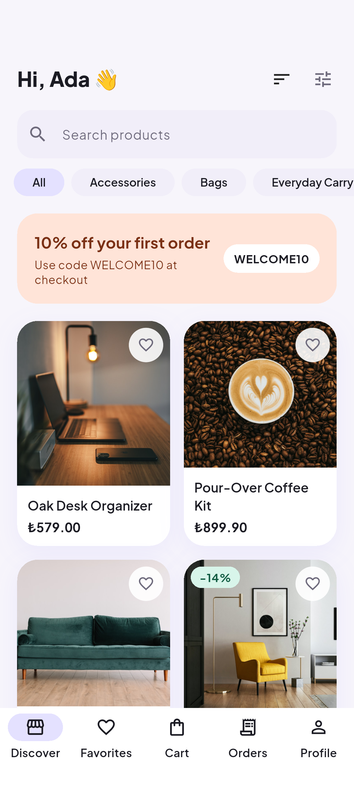
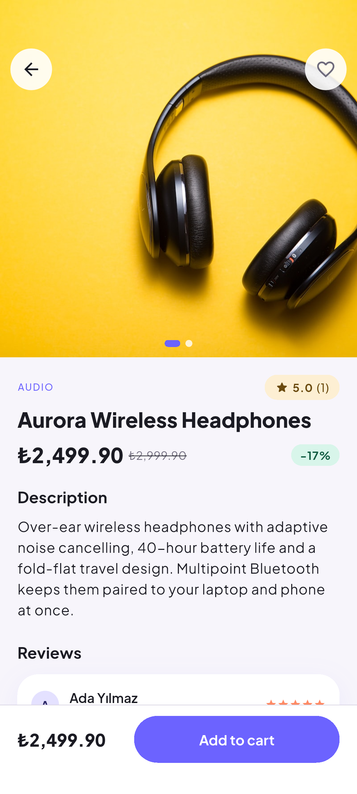
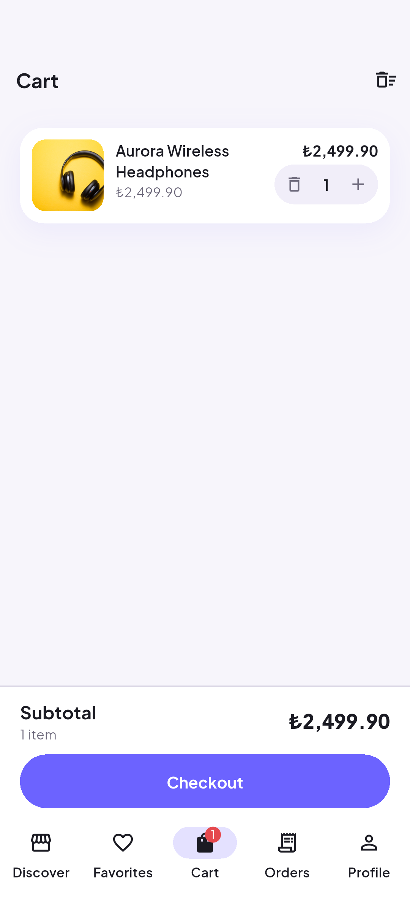
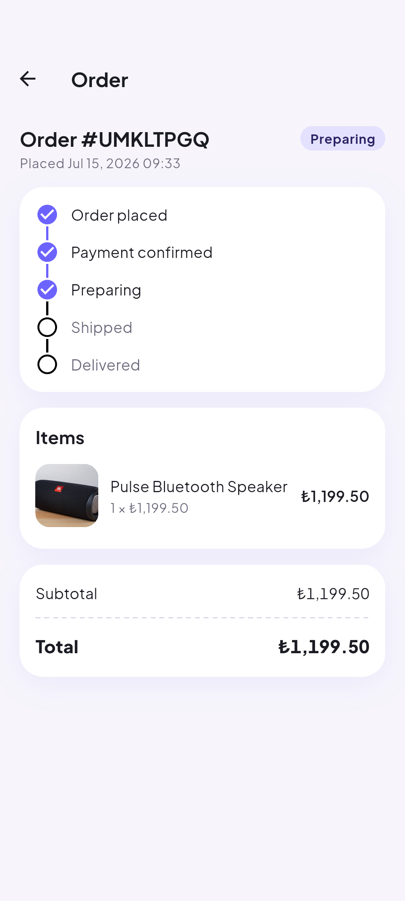
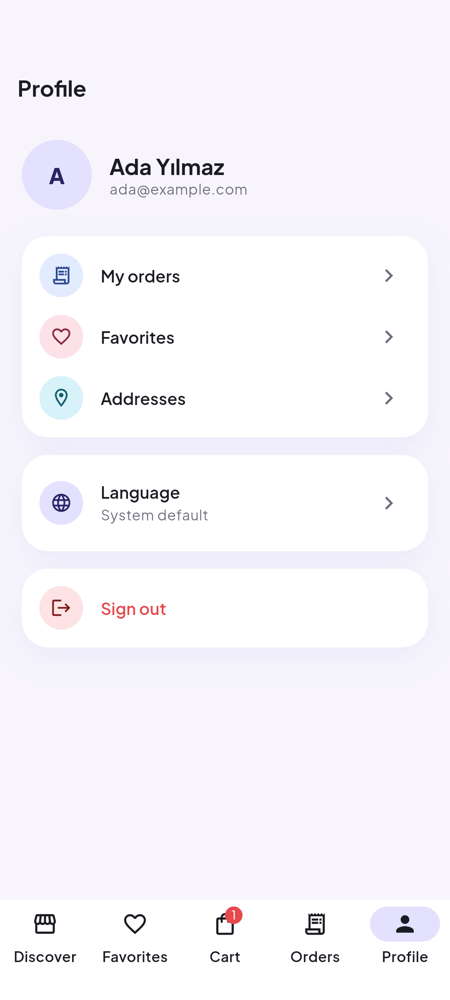
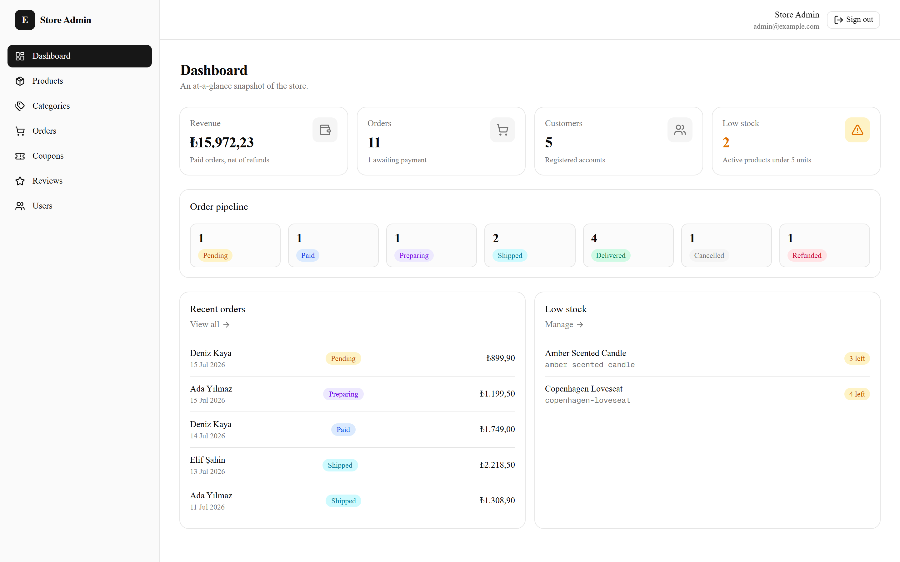
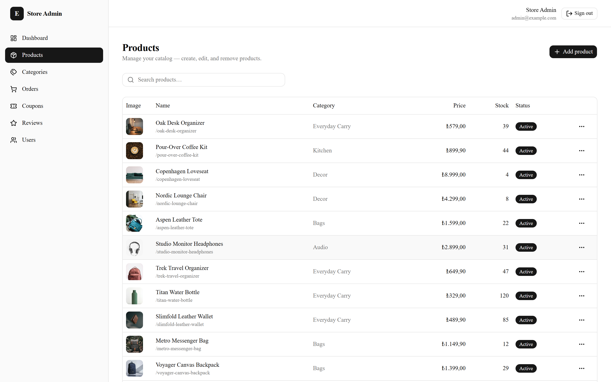
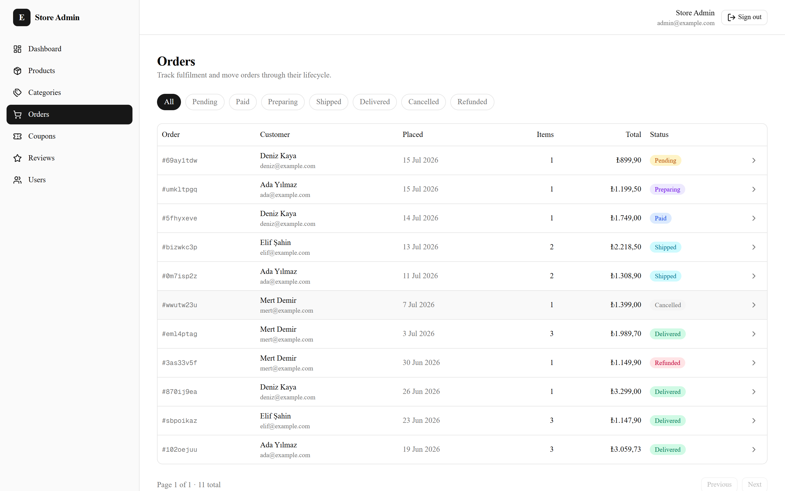
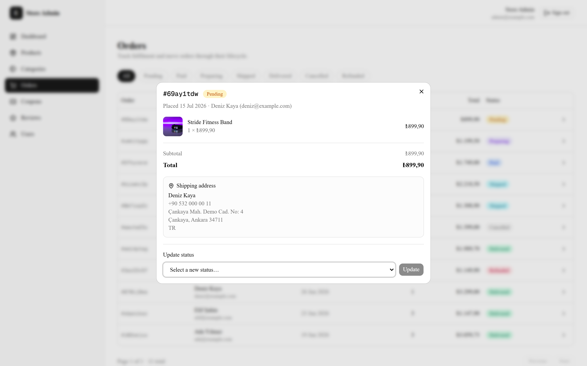

# 🛒 Storefront — Full-Stack E-Commerce Platform

[](https://github.com/gorkdev/ecommerce-app/actions/workflows/api.yml)
[](https://github.com/gorkdev/ecommerce-app/actions/workflows/admin.yml)
[](https://github.com/gorkdev/ecommerce-app/actions/workflows/mobile.yml)
[](LICENSE)

A production-style e-commerce platform built end to end: a **Flutter**
customer app with a custom design system, a **NestJS** REST API, a
**Next.js** admin dashboard, **PostgreSQL** + **MinIO**, **Stripe** payments
and **FCM** push — shipped with **545 automated tests** and per-package CI.

## Screenshots

### Mobile app (Flutter)

<p>
  
  
  
  
  
</p>

### Admin panel (Next.js)

<p>
  
  
</p>
<p>
  
  
</p>

## Features

- **Customer app:** catalog with search/filters, server-truth cart, Stripe
  checkout with coupons and retryable payments, order tracking timeline,
  verified-buyer reviews, favorites, English/Turkish i18n, push
  notifications that deep-link into the order, light + dark theme
- **Admin panel:** KPI dashboard, product/category CRUD with
  direct-to-MinIO image uploads, order lifecycle management, coupons,
  review moderation, user & role management
- **API:** JWT auth with rotating refresh tokens, Stripe webhooks with
  stock reservation, atomic coupon redemption, server-rendered localized
  push copy, presigned media uploads, migrations + DTO validation
  throughout

## Engineering Highlights

- **545 automated tests:** 284 Flutter widget/unit, 133 API unit, 128 API
  e2e against real Postgres + MinIO — all running in CI per package
- **Design tokens, not ad-hoc styles:** pastel palette guarded by a
  WCAG-AA contrast test; screens never hardcode a color
- **Resilient seams:** Stripe, Firebase and MinIO each behind one service
  class — everything builds, runs and tests without their credentials
- **Server-authoritative money:** totals computed server-side only;
  clients render decimal strings verbatim
- The screenshot gallery above is generated by an on-device integration
  test walking the real app against the seeded API

## Tech Stack

| Layer | Technology | Version |
|-------|-----------|---------|
| Mobile | Flutter · Riverpod · Dio · go_router | Flutter 3.41+ · Riverpod 3 |
| API | NestJS · Prisma | NestJS 11 · Prisma 7 |
| Database / storage | PostgreSQL · MinIO | 18 · latest |
| Admin | Next.js · React · TanStack Query · Tailwind | Next 16 · React 19 |
| Payments / push | Stripe · FCM | stripe-node 22 · firebase-admin 14 |
| Runtime | Node.js | 24 LTS |

## Getting Started

```bash
cp .env.example .env
docker compose up -d                          # postgres + minio

cd api && npm install && npx prisma migrate dev
npm run prisma:seed                           # demo store with real photos
npm run start:dev                             # http://localhost:3000

cd ../admin && npm install && npm run dev     # http://localhost:3001
cd ../mobile && flutter pub get && flutter run
```

| Demo account | Email | Password |
|--------------|-------|----------|
| Admin | `admin@example.com` | `Admin123!` |
| Customer | `ada@example.com` | `Customer123!` |

Stripe/Firebase setup and per-package details:
[`api/README.md`](api/README.md) · [`admin/README.md`](admin/README.md) ·
[`mobile/README.md`](mobile/README.md)

## License

[MIT](LICENSE)
